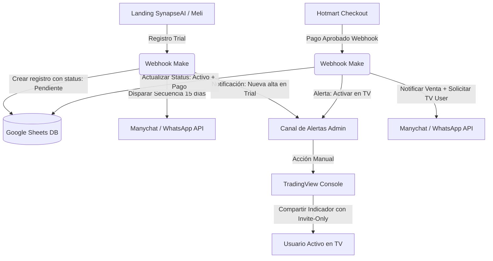

# Infraestructura y Operaciones — Synapse AI Scanner

> Mantenido por `/product`. Fuente de verdad del ecosistema de sistemas, automatizaciones (Make, Manychat, WhatsApp API) y procesos manuales (activaciones en TradingView, conciliación en Google Sheets) que permiten operar el negocio de manera estructurada y escalable.

---

## 1. Arquitectura General del Ecosistema

El siguiente diagrama detalla cómo se conectan los componentes del sistema, desde la captación de un usuario en trial hasta la compra de una membresía y su posterior activación y control de accesos.

> **Versión actualizada:** `arquitectura_final_embudo.md` incorpora la decisión de trial continuo (sin fechas de corte), la estructura de dos grupos de WhatsApp (nutrición vs. señales) y las ventanas de conversión por quincena — ante conflicto con el diagrama de abajo, gana ese documento.

---

## 2. Mapa de esta Carpeta

* [procesos_manuales.md](file:///Users/juanzarate/juan_dev_projects/trading_view_projects/indicators/v3-SynapseAI_Scanner/marketing/business_plan/Infraestructura/procesos_manuales.md) — Procedimientos paso a paso para la activación/desactivación de accesos en TradingView, soporte por WhatsApp y conciliación de pagos.
* [flujos_automatizacion.md](file:///Users/juanzarate/juan_dev_projects/trading_view_projects/indicators/v3-SynapseAI_Scanner/marketing/business_plan/Infraestructura/flujos_automatizacion.md) — Definición técnica de los escenarios de Make, disparadores de Manychat y consumo de la WhatsApp API para gestionar el trial y las compras.
* [base_datos_sheets.md](file:///Users/juanzarate/juan_dev_projects/trading_view_projects/indicators/v3-SynapseAI_Scanner/marketing/business_plan/Infraestructura/base_datos_sheets.md) — Estructura detallada de la base de datos de clientes, el registro contable de cobros y el panel financiero alojado en Google Sheets.
* [arquitectura_final_embudo.md](./arquitectura_final_embudo.md) — Arquitectura consolidada del embudo (trial continuo + grupos de WhatsApp segmentados + ventanas de conversión por quincena) y roadmap de lo que falta construir.

---

## 3. Estado de Integración del Stack

| Componente | Rol en el Ecosistema | Estado / Integración |
|---|---|---|
| **Landings (`Landing_SynapseAI`, `Landing_Meli`)** | Captación inicial de prospectos y punto de entrada al trial de 15 días. | **Activas / En desarrollo** |
| **Make (ex Integromat)** | Cerebro de integración. Conecta formularios, base de datos en Sheets y Manychat. | **Pendiente de mapear escenarios** |
| **Manychat + WhatsApp API** | Automatización de la secuencia por hito de trial (Días 1 a 15) y recordatorios de renovación. | **Integrado con secuencia básica** |
| **Hotmart Webhooks** | Notificación instantánea de compras, renovaciones y reembolsos de los 3 planes de membresía. | **Por configurar en checkout** |
| **TradingView (Invite-Only)** | Producto final. Requiere otorgar o quitar acceso manualmente según la vigencia de la membresía. | **Proceso 100% manual hoy** |
| **Google Sheets DB** | Base de datos maestra de usuarios, historial contable de pagos y panel de reparto de ganancias. | **Pendiente de creación de pestañas** |

---

## 4. Reglas Críticas de Operación

1. **Privacidad de Datos:** La base de datos en Google Sheets contiene información sensible (WhatsApp, emails, nombres). El acceso debe restringirse únicamente a los socios principales del negocio (Fundador y Meli).
2. **Higiene del Username de TradingView:** El nombre de usuario en TradingView es **sensible a mayúsculas y minúsculas y no permite errores**. Cualquier error al ingresarlo dejará al usuario sin acceso. Debe haber un proceso de validación previa en los flujos de Make/Manychat.
3. **Control de Tiempos de Acceso:** Al no existir una API pública de TradingView para gestionar de manera programática el listado de *Invite-Only*, la conciliación de fechas de expiración es una tarea operativa prioritaria semanal.
