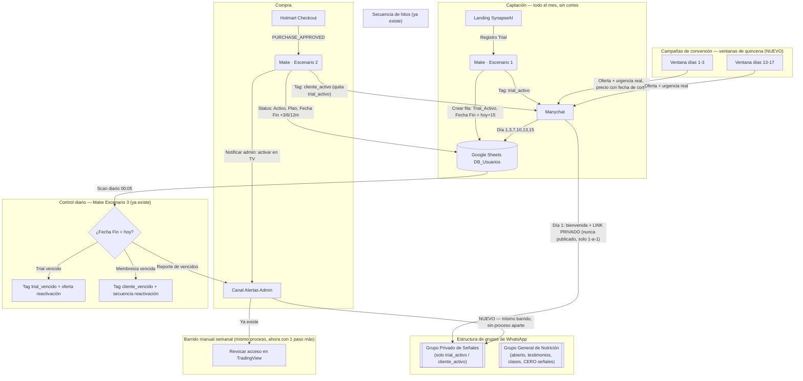

# Arquitectura Final del Embudo — Trial Continuo + Conversión por Quincenas

> Mantenido por `/product`. Consolida las dos discusiones de audio sobre logística (fechas de corte vs. entrada dinámica, y Hotmart vs. Telegram Bot Subscription) en una sola arquitectura final. Complementa — no reemplaza — a `README.md`, `flujos_automatizacion.md`, `procesos_manuales.md` y `base_datos_sheets.md`: la mayor parte de esto ya está diseñado ahí, este documento muestra cómo encajan las piezas nuevas.
>
> **Estado:** propuesta consolidada, lista para pasar a `ESTRATEGIA.md` como decisión oficial en cuanto se confirme.

## 1. Las 4 decisiones que fijan esta arquitectura

| # | Decisión | De dónde sale |
|---|---|---|
| 1 | **Trial continuo, sin fechas de corte** — se puede iniciar cualquier día del mes | Ya implícito en `flujos_automatizacion.md` Escenario 1 (per-registro, no por lote); confirmado en el análisis de los dos audios |
| 2 | **Canal principal: WhatsApp** — no se reemplaza por Telegram | Coherencia con toda la marca ya construida (Messaging Bible, landing, VSL) + la audiencia real es predominantemente WhatsApp, no Telegram |
| 3 | **Dos grupos separados, no dos plataformas** — Grupo General (nutrición, abierto) vs. Grupo Privado de Señales (solo pago/trial verificado) | Ya definido en `estructura_indicador_reunion_gustavo_juan.md` §6 (regla de privacidad de señales) |
| 4 | **Campañas de conversión en ventanas de quincena** (días 1-3 y 13-17 de cada mes) | Aporte nuevo del segundo audio — refina el "modelo híbrido" ya propuesto en `synapse_launch_blueprint.md` §0 dándole fecha concreta |

**Lo que se descarta, con su razón:**
- ❌ Fechas de corte para *iniciar* el trial — agrega fricción justo en el punto de mayor fuga ya identificado (~45% no se activa, `synapse_messaging_bible.md` §6).
- ❌ Mover el trial gratuito a Hotmart vía API — el trial nunca pasó por Hotmart en el diseño original; no hay problema que resolver ahí.
- ❌ Telegram como reemplazo del canal de señales — el problema que se buscaba resolver (fuga de señales a no-pagantes) ya se resuelve con segmentación de grupos, sin cambiar de plataforma.

## 2. Diagrama de arquitectura

## 3. Qué resuelve cada pieza nueva

| Preocupación del audio | Solución | Por qué no requiere nada nuevo de infraestructura |
|---|---|---|
| "Solicitudes falsas" al grupo | El link del Grupo Privado de Señales nunca se publica — Manychat lo entrega 1-a-1 solo a quien ya tiene tag `trial_activo` o `cliente_activo` en el Día 1 de la secuencia | El tag y la secuencia de Día 1 ya existen (`flujos_automatizacion.md` §2-3); solo se agrega el link a ese mensaje |
| "Automatizar entradas y salidas del grupo" | La *entrada* se automatiza (vía el link entregado por Manychat). La *salida* sigue siendo manual — WhatsApp no tiene API de gestión de grupos — pero se hace en el mismo barrido semanal que ya existe para TradingView | Cero proceso nuevo: es una casilla más en una checklist que ya se ejecuta |
| "Cómo dar el trial gratis sin costos de Hotmart" | No aplica — el trial nunca pasa por Hotmart | Ahorra la integración vía API que proponía el audio |
| "Que las señales no se filtren a quien no paga" | Grupo Privado de Señales separado del Grupo General de Nutrición; el general nunca recibe señales, solo contenido educativo/testimonios | Ya definido en la reunión (§6); no depende del canal |
| "Sincronizar la oferta con la liquidez del cliente" | Campañas de conversión en las ventanas 1-3 y 13-17 | Nuevo, pero es solo *cuándo* disparar la secuencia de oferta ya diseñada — no requiere infraestructura adicional |

## 4. Roadmap — qué falta construir realmente

| Fase | Tarea | Estado |
|---|---|---|
| 1 | Confirmar esta arquitectura como decisión oficial en `ESTRATEGIA.md` | ⬜ Pendiente de tu confirmación |
| 2 | Agregar el link del Grupo Privado de Señales al mensaje de Día 1 de Manychat (`flujos_automatizacion.md` §3) | ⬜ Ajuste menor a un flujo ya existente |
| 3 | Crear el Grupo General de Nutrición si no existe todavía, con regla explícita de "cero señales" para quien lo administra | ⬜ Operativo, no técnico |
| 4 | Agregar "sacar del Grupo Privado de Señales" al checklist semanal de `procesos_manuales.md` §1.2 | ⬜ Edición de documento, una línea |
| 5 | Definir el copy y la oferta específica de las ventanas de quincena (días exactos: ¿1-3 o 28-3? ¿13-17 o 12-17?) | ⬜ Pendiente — el audio dio rangos aproximados, falta la fecha exacta |
| 6 | Conectar las ventanas de quincena con el precio de lanzamiento con fecha de corte (ya decidido como pendiente en `pricing_strategy.md` §3) | ⬜ Depende de que se confirme la fecha de corte del precio |

**Lo que ya está construido y no requiere ningún cambio:** Escenario 1 (registro), Escenario 2 (compra), Escenario 3 (expiración diaria), la estructura de `DB_Usuarios`, los tags de Manychat, y el proceso manual de revocación en TradingView.

## 5. Próximos pasos

1. Confirmar los rangos exactos de las ventanas de quincena (el audio menciona 27/28/29 al 2/3, y 12/13 al 17 — hay que fijar un rango único).
2. Si se confirma esta arquitectura, la paso a `ESTRATEGIA.md` como decisión fechada y actualizo `flujos_automatizacion.md` y `procesos_manuales.md` con los 2 ajustes menores de la sección 3.
